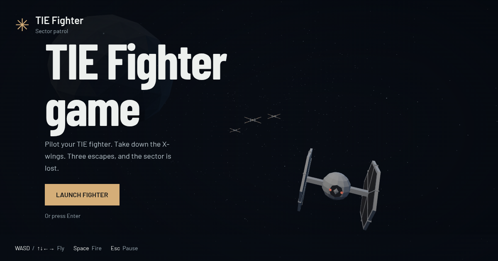

# TIE Fighter

A browser space shooter built with Three.js: choose a low-poly TIE Fighter or TIE Interceptor, aim at
X-wings, and hold the sector for as long as you can; no account needed.



## Website

- [Play in English](https://cocodedk.github.io/tie-fighter/)
- [بازی به فارسی (Persian)](https://cocodedk.github.io/tie-fighter/fa/)

## Features

- Choose your ship before launch; your preference is remembered across visits and languages.
- Fighter: two chin-mounted laser cannons; Interceptor: four wing-mounted cannons.
- Lasers fire from their mounts and converge on the red aiming cross.
- Procedural ships, green lasers, a red aiming cross, and a moving star field.
- Keyboard and touch controls, with English and Persian interfaces.
- Destroy X-wings for 100 points each; dodge their aimed red lasers.
- Three hull points, brief protection after a hit, and a visible damage flash.
- Every five kills fully repair the hull; the HUD counts down to the next repair.
- Zero hull or three escapes end the run; faster flight responds immediately.
- Your best score and pilot career are saved here and shared between both languages.
- Six ranks, three medals, and three honors reward campaign and career kills.
- Reach Darth Vader at 250 campaign kills to win with a low-poly victory animation.
- New game restarts at Cadet and preserves your best score and earned awards.
- Open **Service record** before flying, while paused, or after a run to see progress.
- Native Chrome WebMCP tools for inspecting and controlling the game.

Press Enter or select **Launch** to start; use WASD or arrow keys to move
and hold Space to fire; forward flight is automatic.
On touch screens, use the direction buttons and hold Fire.
Press Escape or select Pause to pause; switching tabs also pauses the game.
Select **Fly Again** or press Enter after a run to restart.

## Build from source

Install Node.js 24 and npm; playing requires a browser with WebGL2 support.
The browser tests use Google Chrome with native WebMCP enabled by Playwright.

```sh
git clone https://github.com/cocodedk/tie-fighter.git
cd tie-fighter
npm ci
npx playwright install chrome
./scripts/install-hooks.sh
npm run dev
```

Open the local URL printed by Vite.

```sh
npm run verify   # lint, file limits, browser tests, production build
npm run preview  # serve the production build locally
```

See the [rank and award plan](docs/progression.md) for every kill threshold.

See [contributing](CONTRIBUTING.md) for checks and hooks, and
[Chrome WebMCP setup](docs/webmcp.md) for the experimental flag and tool API.
Ordinary play does not need WebMCP.

## Architecture

```text
src/        Game loop, ships, combat, input, translations, and styles
public/     Favicon, social image, robots.txt, and sitemap
fa/         Persian HTML entry point
scripts/    Repository checks, hooks, and site metadata
tests/     Playwright browser tests
```

| Layer | Technology |
| --- | --- |
| Rendering | Three.js and WebGL2 |
| Application | JavaScript ES modules and CSS |
| Build | Vite |
| Verification | Playwright, Oxlint, Biome |
| Hosting | GitHub Pages |

## Author

Babak Bandpey, [Cocode](https://cocode.dk) ·
[LinkedIn](https://linkedin.com/in/babakbandpey) ·
[GitHub](https://github.com/cocodedk)

## License

[Apache-2.0](LICENSE) | © 2026 [Cocode](https://cocode.dk) |
Created by [Babak Bandpey](https://linkedin.com/in/babakbandpey)
